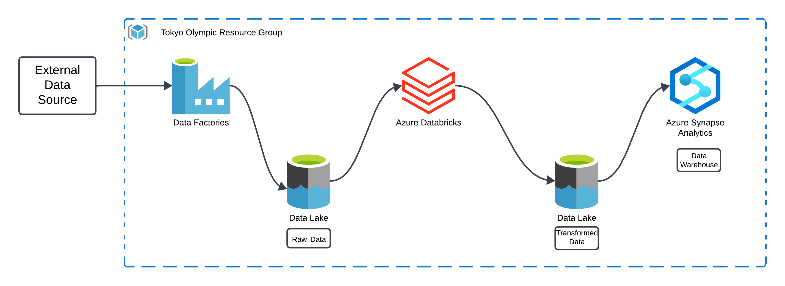

# Olympics-DataAnalytics-Using-Azure

## Overview
This main goal of this project is to create a data pipeline to extract data of Tokyo Olympics, clean and transform it and store the data in a database or warehouse to get meaningful insights from it.

## Architecture

In the above architecture the tools used are as follows

### 1. Azure Data Factory : 
This tool is used to extract the data from the external source and copy it to the data lake storage as raw data. Using this tool it becomes easier to execute this process as there is no                            coding invloved only we have to drang and drop the activities and configure it.

Activities used :

a. Web Activity : This activity is used to list the data files from the external sources which in our case is github. It extracts the complete data of the repository which also contains 
the links to the data files. These links are extracted in the further process .

b. ForEach Activity :  This activity is used for looping through the repository folder and get multiple files in a single run eliminating the need to create a seperate activity for every                          file and hence saving time and resources as well.

c. Copy Data Activity : This activity is used to copy data from the external source to our Data Lake using the links from previous activity as input to extract the files.

### 2. Azure Data Lake Storage :
This is used to create a data lake to store the extracted raw data as well as transformed data as a staging process before it being used for further analysis.

### 3. Azure Databricks :  
This Azure service is used as a platform for data tranformation. We need to create a compute cluster for computing the code and a notebook is also created where we can write our tranformation code and also test it. This notebook uses the cluster created as a computing resource.

### 4. Azure Synapse Analytics : 
The transformed data is now ready to be loaded into a database/data warehouse and hence Synapse analytics is used. Created a lake database and loaded the transformed data into the database by creating external tables. This can be further used for analysis by running SQL scripts over the database table to generate meaningful insights.

## Lessons Learned : 
I have learned some new things during the execution of this project.
1. Got to know the process of copying multiple files one time from an external source using link of the github repository. Also extracted the name of the file from the information received through the file and concatenated the name with the base url to download the files.
2. Used the foreach activity to loop through multiple files eliminating the need of executing the process repeatedly.
3. Used the debug functionality of Azure Data Factory to debug the errors during the pipeline run which made the process seamless.
4. Used App Registration to create an app and assigned 'role assignment' through IAM to the container so that synapse analytics can access the data and load it into the tables.
5. Created Lake Database and loaded the transformed data from the data lake into this database.
6. This whole process can be executed in the AZURE SYNAPSE ANALYTICS as it is a complete package of analytics servives but, I have used different services to explore how services are used and how can we execute
a process in these services  
